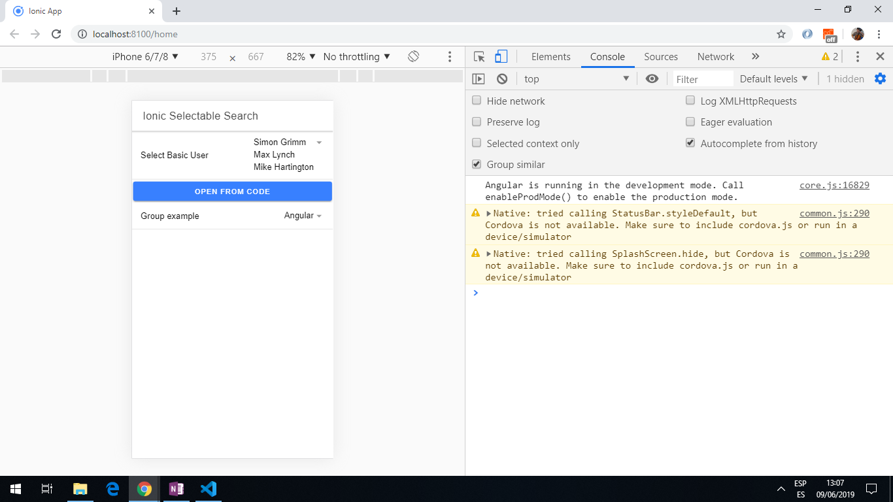

# :zap: Ionic Select Searchbar

* App created using the [Ionic framework](https://ionicframework.com/docs) and the [Ionic Selectable search component](https://www.npmjs.com/package/ionic-selectable) to create a list of selectable elements.
* Tutorial code from [Simon Grimm at the Ionic Acdemy](https://www.youtube.com/channel/UCZZPgUIorPao48a1tBYSDgg) - see [:clap: Inspiration](#clap-inspiration) below
* **Note:** to open web links in a new window use: _ctrl+click on link_


## :page_facing_up: Table of contents

* [:zap: Ionic Select Searchbar](#zap-ionic-select-searchbar)
  * [:page_facing_up: Table of contents](#page_facing_up-table-of-contents)
  * [:books: General info](#books-general-info)
  * [:camera: Screenshots](#camera-screenshots)
  * [:signal_strength: Technologies](#signal_strength-technologies)
  * [:floppy_disk: Setup](#floppy_disk-setup)
  * [:computer: Code Examples](#computer-code-examples)
  * [:cool: Features - Ionic Selectable](#cool-features---ionic-selectable)
  * [:clipboard: Status & To-do list](#clipboard-status--to-do-list)
  * [:clap: Inspiration](#clap-inspiration)
  * [:file_folder: License](#file_folder-license)
  * [:envelope: Contact](#envelope-contact)

## :books: General info

* array of data used to test selectable searches.

## :camera: Screenshots



## :signal_strength: Technologies

* [Ionic/angular v6](https://www.npmjs.com/package/@ionic/angular)
* [Ionic v6](https://ionicframework.com/)
* [Angular v14](https://angular.io/)
* [Ionic Selectable v4](https://www.npmjs.com/package/ionic-selectable) An Ionic component similar to Ionic Select, that allows user to search items, including async search, infinite scrolling and more

## :floppy_disk: Setup

* Run `npm i` to install dependencies
* To start the server on _localhost://8100_ type: 'ionic serve'

## :computer: Code Examples

```typescript
<ion-item>
  <ion-label>Group example</ion-label>

  <ionic-selectable
    [(ngModel)]="group"
      itemValueField="id"
      itemTextField="name"
      groupTextField="type"
      [items]="groups">

      <ng-template ionicSelectableGroupTemplate let-group="group">
        {{ group.text }}
      </ng-template>

  </ionic-selectable>
</ion-item>
```

## :cool: Features - Ionic Selectable

* **Features copied from Ionic component** [documentation](https://www.npmjs.com/package/ionic-selectable):

* Single selection
* Multiple selection
* Search items
* Search items asynchronously
* Search by several item fields
* Forms
* InfiniteScroll
* VirtualScroll
* Templates
* Grouping items
* Editing, adding and deleting items
* Disabling items

## :clipboard: Status & To-do list

* Status: Working
* To-do: Nothing

## :clap: Inspiration

* Project inspired by [Simon Grimm´s Youtube video: Ionic Searchable Select Component Customisation](https://www.youtube.com/watch?v=SO_AWrrmZlY)

## :file_folder: License

* This project is licensed under the terms of the MIT license.

## :envelope: Contact

* Repo created by [ABateman](https://github.com/AndrewJBateman), email: gomezbateman@yahoo.com
